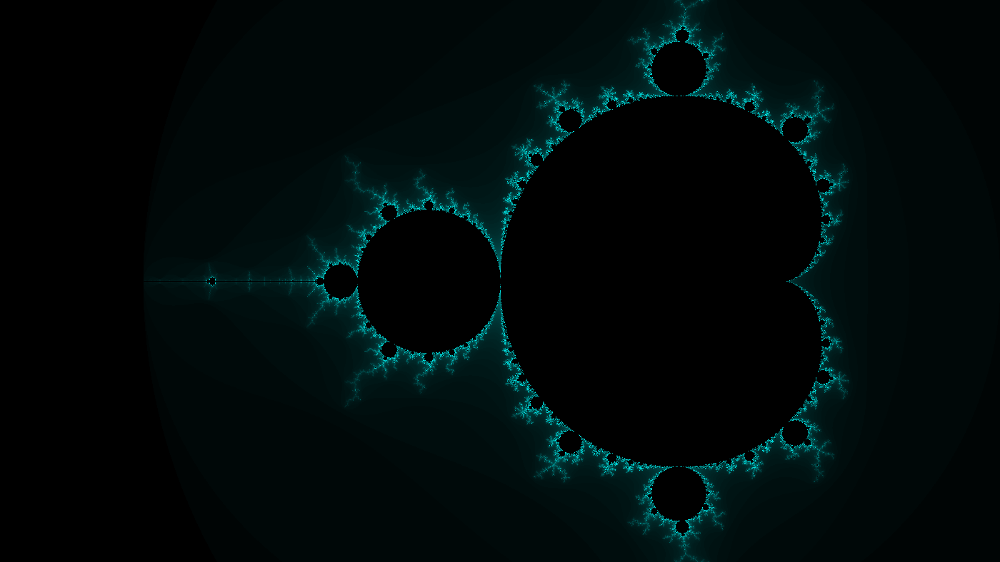

# purescript-frack



## Configuration

* Config values in the `Mandelbrot` module:

1. `maxCount :: Int`

the number of iterations to run per complex number before
it should be considered convergent.

* Config values in `Main`:

1. `minX, maxX :: Number`

the x-bounds on the complex plane.

2. `minY, maxY :: Number`

y-bounds on the complex plane. By default, `|minY| = |maxY|`.

3. `sizeScaleFactor :: Number`

a coefficient that determines the scaling factor of the resulting image.
If, for example, you want the width to be 1920 pixels, you solve:

```
1920.0 = dx*sizeScaleFactor ⇒
sizeScaleFactor = 1920.0/dx ≈ 548.57
```

4. `colorScaleFactor :: Number`

defined by `colorScaleFactor = 1000.0 / toNumber maxCount`, it determines
the smoothness of the gradients in the resulting image.

5. `changeColors`

a function that determines the rgba color of each pixel as a function of the
pixel's (x, y) coordinates and previous color (which is usually ignored).

## Running

On node:

```
> npm install
> psc-package update
> pulp run
```

On the browser:

1. `> psc-package update`
2. Comment the current `main` body
3. Uncomment the `main` body below that one
4. Fix any import errors
5. `> pulp build --to index.js`
6. open `index.html` in your browser